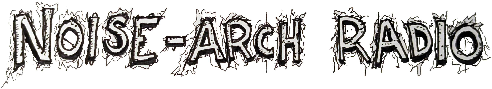

# noise-arch radio

This is the source code behind [noise-arch radio](http://noise-arch.live), an audio
streaming station sourced with archival cassette tape content from 
[archive.org](https://archive.org/details/noise-arch).

The cassette archive is described as this:

> This collection is a compilation of underground/independently-released cassette tapes from the days when the audio cassette was the standard method of music sharing... generally the mid-eighties through early-nineties. The material represented includes tape experimentation, industrial, avant-garde, indy, rock, diy, subvertainment and auto-hypnotic materials. Much of this material defies category, and has therefore not been given one.
>
>The bulk of the tapes in this library were donated to the project by former CKLN FM radio host Myke Dyer in August of 2009. The original NOISE-ARCH site was hosted and maintained by Graham Stewart and Mark Lougheed.

Infinite thank yous to [The Internet Archive](https://archive.org) for making this 
material available and for preserving rare media forever.

# TODO: 

Maybe do these at some point (or at least convert them to issues):

* link to discogs search
* image carousel
* update page `<title>`
* blocklist for dumb items
* recent past plays
* enable https
* normalize volume
